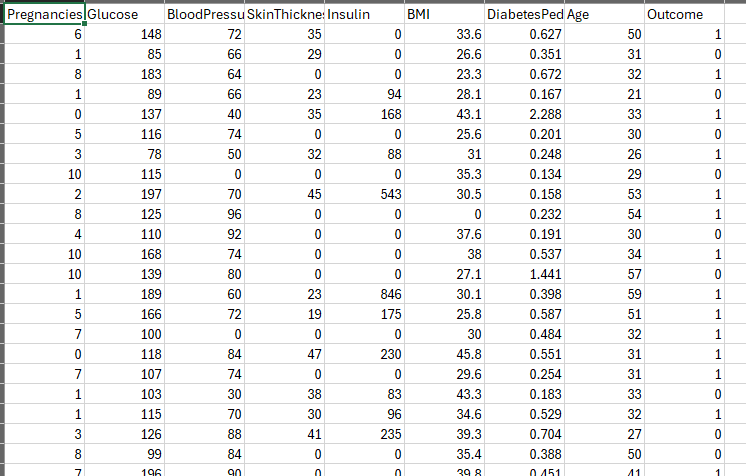
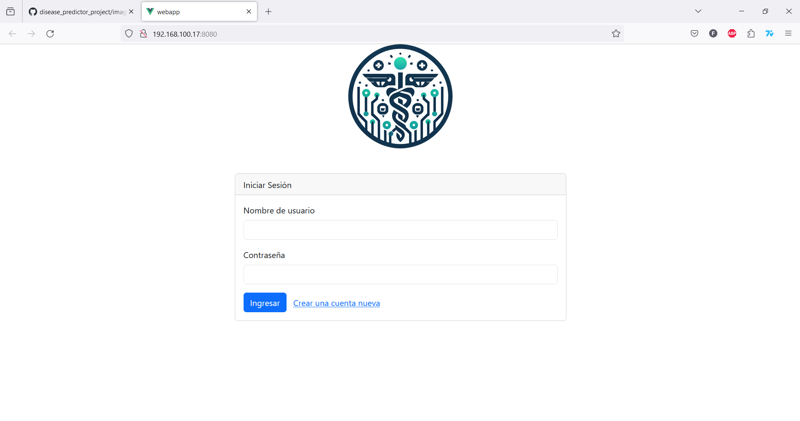
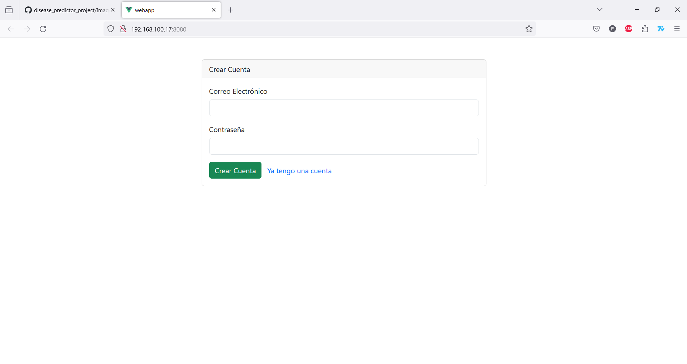
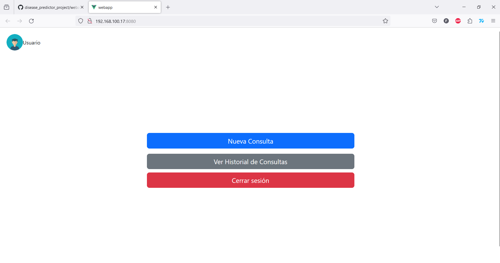
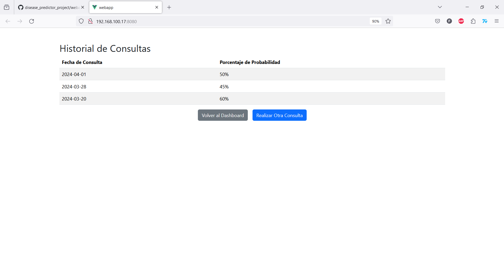
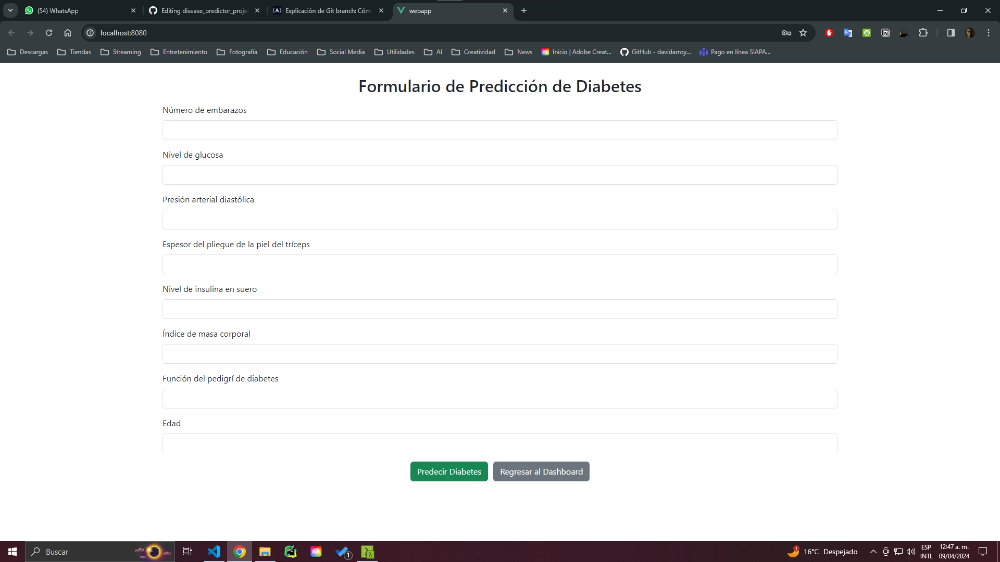
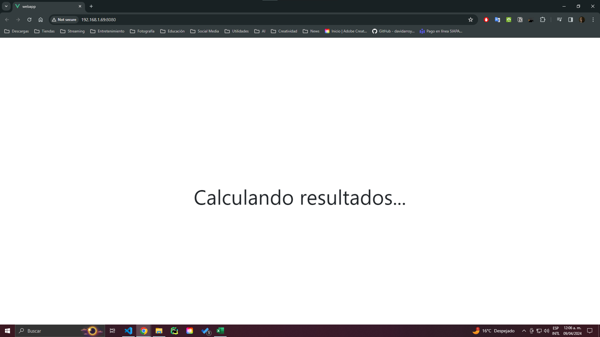
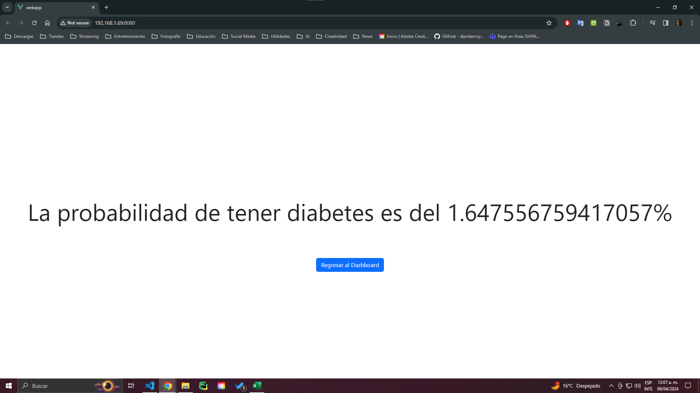

# Análisis de Diabetes en Mujeres Embarazadas

En este proyecto buscamos integrar una red neuronal que prediga la probabilidad de que una mujer embarazada tenga diabetes. Para ello, se utilizará un dataset que contiene información sobre la historia clínica de mujeres embarazadas y si estas desarrollaron diabetes o no. Este modelo se entrenará y se integrará en una aplicación web  través una API implementada en FastAPI y se podrá interactuar con él en una interfaz gráfica creada con Vue.js. 
Con esta buscamos crear una aplicación similar un "Health Tracker", pero simplificada, ya que los datos deben ser ingresados por el usuario de forma manual y sólo se analizarán para una única enfermedad.

## Dataset

El dataset utilizado para este proyecto es el [Pima Indians Diabetes Database](https://www.kaggle.com/uciml/pima-indians-diabetes-database) que contiene información sobre la historia clínica de mujeres de la tribu Pima y si estas desarrollaron diabetes o no. 



## Modelo de Clasificación

El modelo de clasificación que se utilizará para este proyecto  se entrenó con el dataset mencionado anteriormente y la librearía de TensorFlow. El modelo se guardó en un archivo con extensión .h5 y se integrará en la aplicación web a través de la API Implementada en el Backend.

### Codigo del Modelo

```python
# Importar las librerías necesarias
import numpy as np
import pandas as pd
import tensorflow as tf
from sklearn.model_selection import train_test_split
from sklearn.preprocessing import StandardScaler

# Cargar el dataset de diabetes
df = pd.read_csv("diabetes.csv")

# Separar las variables independientes (X) y la variable dependiente (y)
X = df.iloc[:, :-1].values
y = df.iloc[:, -1].values

# Dividir el dataset en conjunto de entrenamiento y de prueba
X_train, X_test, y_train, y_test = train_test_split(X, y, test_size = 0.2, random_state = 0)

# Escalar las variables independientes
sc = StandardScaler()
X_train = sc.fit_transform(X_train)
X_test = sc.transform(X_test)

# Crear la red neuronal
ann = tf.keras.models.Sequential()
# Añadir la capa de entrada y la primera capa oculta
ann.add(tf.keras.layers.Dense(units=8, activation='relu'))
# Añadir la segunda capa oculta
ann.add(tf.keras.layers.Dense(units=8, activation='relu'))
# Añadir la capa de salida
ann.add(tf.keras.layers.Dense(units=1, activation='sigmoid'))

# Compilar la red neuronal
ann.compile(optimizer = 'adam', loss = 'binary_crossentropy', metrics = ['accuracy'])

# Entrenar la red neuronal
ann.fit(X_train, y_train, batch_size = 32, epochs = 100)

#Exportar el modelo en formato .keras
ann.save("model.h5")
```

## API (Backend)

La API se implementó en FastAPI y se encargará de recibir los datos necesarios para realizar la predicción y devolver el resultado. También se encargará de verificar usuarios para loggearlos y registrarlos, así como de consultar el historial de resultados de los usuarios. Por el momento sólo hemos implementado el endpoint para que el modelo prediga un resultado, pero ya hemos estado realizando muchas pruebas para conectarnos a una base de datos y realizar las funciones necesarios de registro y consulta.

### Codigo de la API

```python
from fastapi import FastAPI, HTTPException
from pydantic import BaseModel
import numpy as np
import tensorflow as tf
from sklearn.preprocessing import StandardScaler
import pandas as pd
from fastapi.middleware.cors import CORSMiddleware

app = FastAPI()

# Lista de orígenes permitidos
origins = [
    "http://localhost:8080",  # Permitir solicitudes desde su frontend VueJS
    "http://localhost:3000", # Esto debido a que tuvimos errores en las pruebas locales
    "http://192.168.1.69:8080"
]

app.add_middleware(
    CORSMiddleware,
    allow_origins=origins,  # Los orígenes que queremos permitir
    allow_credentials=True,
    allow_methods=["*"],  # Permitir todos los métodos
    allow_headers=["*"],  # Permitir todos los encabezados
)

# Clase para los datos de entrada
class DiabetesData(BaseModel):
    pregnancies: int
    glucose: float
    bloodPressure: float
    skinThickness: float
    insulin: float
    bmi: float
    diabetesPedigreeFunction: float
    age: int

# Cargar el modelo de TensorFlow
model = tf.keras.models.load_model("model.h5")

# Cargar el dataset para el scaler
df = pd.read_csv("diabetes.csv")
X = df.iloc[:, :-1].values
scaler = StandardScaler().fit(X)

@app.get("/")
async def root():
    return {"message":"Hello World"}

@app.post("/predict/")
async def predict(data: DiabetesData):
    try:
        print("Recibido")
        # Convertir datos de entrada a DataFrame para escalar
        data_df = pd.DataFrame([data.dict().values()], columns=data.dict().keys())
        scaled_data = scaler.transform(data_df)
        
        # Realizar predicción
        prediction = model.predict(scaled_data)
        
        # Devolver la probabilidad directamente
        return {"probability": float(prediction.flatten()[0]) * 100}
    except Exception as e:
        #raise HTTPException(status_code=500, detail=str(e))
        return {"error":str(e)}
```

## Frontend

El frontend se encuentra finalizado y se implementó con VueJs, este permitirá al usuario ingresar los datos necesarios para realizar la predicción, así como consultar su historial de resultados. Lo que nos falta es implementar toda la comunicación con el backend para enviar y obtener datos, de momento sólo hemos implementado la comunicación con el modelo de predicción.

### Diseño de la Interfaz Gráfica

#### Página inicial (login)


Esta sección es para ingresar a tu cuenta si eres un usuario registrado.

#### Página de registro


Si no te has registrado como usuario puedes crear una nueva cuenta en esta sección.

#### Página principal (Dashboard)


En esta sección se cuenta con 3 opciones:
- Realizar consulta (Ingresar datos al modelo para obtener un resultado)
- Ver el historial de resultados que ha obtenido el usuario
- Cerrar la sesión actual

#### Página de historial de consultas


Esta es la forma en la que se muestra el historial de resultados al usuario (Fecha y Porcentaje).

#### Formulario de Consulta


Este es el formulario que el usuario debe llenar para realizar una consulta al modelo.

#### Pantalla de Carga

En esta pantalla el usuario espera el resultado en lo que el modelo lo calcula.

#### Resultado


Una vez que el resultado ha sido calculado por el modelo se le muestra al usuario.
